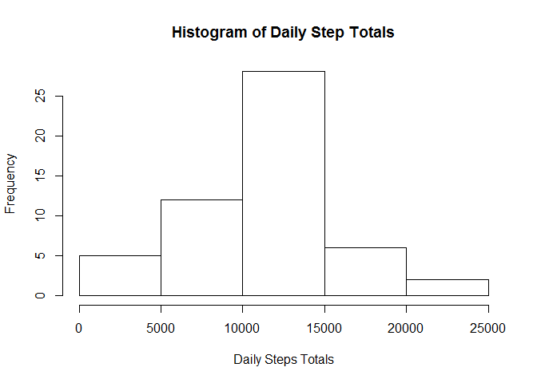
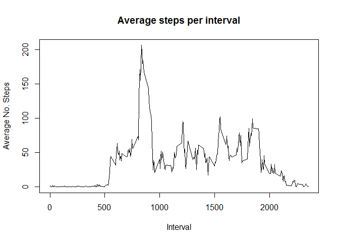
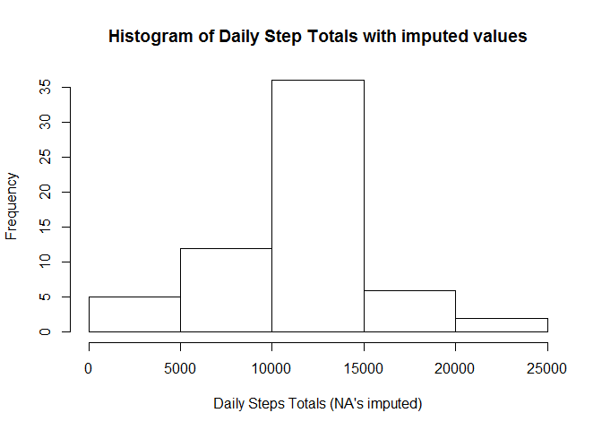
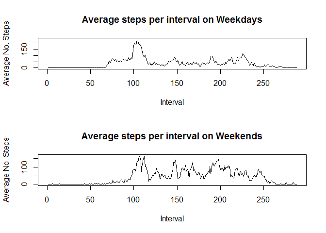

# Reproducible Research: Peer Assessment 1


## Loading and preprocessing the data

### Download file and load to R

First we use the download.file() function to download the raw data file, then use read.table and unz
() to load it to R.


```r
download.file("https://d396qusza40orc.cloudfront.net/repdata%2Fdata%2Factivity.zip", "activity data.zip")

data <- read.table(unz("activity data.zip", "activity.csv"), header=T, sep=",")
```

### Review the data

Now we take a look at the data set to ensure it is consistent with our expectations. We use the str(), summary() and head() functions to explore the data.


```r
str(data)
```

```
## 'data.frame':	17568 obs. of  3 variables:
##  $ steps   : int  NA NA NA NA NA NA NA NA NA NA ...
##  $ date    : Factor w/ 61 levels "2012-10-01","2012-10-02",..: 1 1 1 1 1 1 1 1 1 1 ...
##  $ interval: int  0 5 10 15 20 25 30 35 40 45 ...
```

```r
summary(data)
```

```
##      steps                date          interval     
##  Min.   :  0.00   2012-10-01:  288   Min.   :   0.0  
##  1st Qu.:  0.00   2012-10-02:  288   1st Qu.: 588.8  
##  Median :  0.00   2012-10-03:  288   Median :1177.5  
##  Mean   : 37.38   2012-10-04:  288   Mean   :1177.5  
##  3rd Qu.: 12.00   2012-10-05:  288   3rd Qu.:1766.2  
##  Max.   :806.00   2012-10-06:  288   Max.   :2355.0  
##  NA's   :2304     (Other)   :15840
```

```r
head(data)
```

```
##   steps       date interval
## 1    NA 2012-10-01        0
## 2    NA 2012-10-01        5
## 3    NA 2012-10-01       10
## 4    NA 2012-10-01       15
## 5    NA 2012-10-01       20
## 6    NA 2012-10-01       25
```

## What is mean total number of steps taken per day?

To determine the mean total number of steps per day, we first aggregate the daily totals using the aggregate() function and then use the daily totals to calculate the mean and the median of the daily step counts.  We can also plot the distribution of daily step count using a histogram.


```r
daily_steps <- aggregate(data$steps, list(data$date), FUN=sum)
names(daily_steps) <- c("date", "total_steps")
hist(daily_steps$total_steps, main="Histogram of Daily Step Totals", xlab = "Daily Steps Totals")
```

\

```r
mean(daily_steps$total_steps, na.rm = TRUE)
```

```
## [1] 10766.19
```

```r
median(daily_steps$total_steps, na.rm = TRUE)
```

```
## [1] 10765
```


## What is the average daily activity pattern?

To determine the average daily step pattern, we now aggregate the data across all days, and by time-bin.  Then we can plot the averages and determine the most active time period (on average) of all of the days measured.  We can then use the max() function to determine which interval averages the highest number of steps. 


```r
interval_avg <- aggregate(data$steps, list(data$interval), FUN=mean, na.rm=TRUE)
names(interval_avg) <- c("Interval", "TotalSteps")

plot(interval_avg, type="l", main="Average steps per interval", xlab="Interval", ylab="Average No. Steps")
```

\

```r
interval_avg[which(interval_avg$TotalSteps == max(interval_avg$TotalSteps)),]
```

```
##     Interval TotalSteps
## 104      835   206.1698
```

This shows that the 835 time interval on average has the most number of steps with a monthly average of 206.1698113 steps.

## Imputing missing values

First we determine how many rows of the dataset contain NA values for the steps variable.  We can do this by calling the nrow() function on the subset of "data" which contains NA values in the steps column.


```r
nrow(data[is.na(data$steps),])
```

```
## [1] 2304
```

This shows that there are 2304 NA values in steps variable of the data table. Furhtermore, it is clear that all of these NA values occur on individual days (and there are 8 of these (8 x 288 = 2,304!))

A very simple imputation model would be to replace these values with the average number of steps per time interval into these days.  We can take the values from the interval_avg data table.  To do this, we create a new data frame called "new_data" and merge the NA values in the "data" frame into it and merge with the average steps from the "interval_avg" frame.  Then we can use rbind() to link the new average values with the existing non-NA values in the "data" frame.

Once we are done, we confirm with the summary() function that we have removed the NA values and also use nrow() to double check.


```r
new_data <- data
new_data <- merge(data[is.na(data$steps),],interval_avg, by.x="interval", by.y="Interval", all.x=TRUE)
new_data <- new_data[,c(4,3,1)]
names(new_data) <- c("steps", "date", "interval")
new_data2 <- rbind(data[!is.na(data$steps),], new_data)

summary(new_data2)
```

```
##      steps                date          interval     
##  Min.   :  0.00   2012-10-01:  288   Min.   :   0.0  
##  1st Qu.:  0.00   2012-10-02:  288   1st Qu.: 588.8  
##  Median :  0.00   2012-10-03:  288   Median :1177.5  
##  Mean   : 37.38   2012-10-04:  288   Mean   :1177.5  
##  3rd Qu.: 27.00   2012-10-05:  288   3rd Qu.:1766.2  
##  Max.   :806.00   2012-10-06:  288   Max.   :2355.0  
##                   (Other)   :15840
```

```r
nrow(new_data2[is.na(new_data2$steps),])
```

```
## [1] 0
```

We can now repeat the histogram and calculations of mean and median steps as per question 1:


```r
daily_steps2 <- aggregate(new_data2$steps, list(new_data2$date), FUN=sum)
names(daily_steps2) <- c("date", "total_steps")
hist(daily_steps2$total_steps, main="Histogram of Daily Step Totals with imputed values", xlab = "Daily Steps Totals (NA's imputed)")
```

\

```r
mean(daily_steps2$total_steps)
```

```
## [1] 10766.19
```

```r
median(daily_steps2$total_steps)
```

```
## [1] 10766.19
```


## Are there differences in activity patterns between weekdays and weekends?

Now we can create an indicator variable called "weekday" which uses the day of the week generated by the weekdays() function. This indicator variable then needs to be coerced to a factor.


```r
new_data2$date <- as.Date(new_data2$date)
new_data2$dayofweek <- weekdays(new_data2$date)
new_data2$weekday <- 0
new_data2[new_data2$dayofweek %in% c("Monday", "Tuesday", "Wednesday", "Thursday", "Friday"),]$weekday <- "weekday"
new_data2[new_data2$dayofweek %in% c("Saturday", "Sunday"),]$weekday <- "weekend"
new_data2$weekday <- as.factor(new_data2$weekday)
```

Now that we have created the indicator we can average the number of steps per interval and plot:


```r
interval_avg2 <- aggregate(new_data2$steps, list(new_data2$interval, new_data2$weekday), FUN=mean, na.rm=TRUE)
names(interval_avg2) <- c("interval", "weekday","steps")
par(mfrow=c(2,1))
plot(interval_avg2[interval_avg2$weekday == "weekday",]$steps, type="l", main="Average steps per interval on Weekdays", xlab="Interval", ylab="Average No. Steps")
plot(interval_avg2[interval_avg2$weekday == "weekend",]$steps, type="l", main="Average steps per interval on Weekends", xlab="Interval", ylab="Average No. Steps")
```

\
